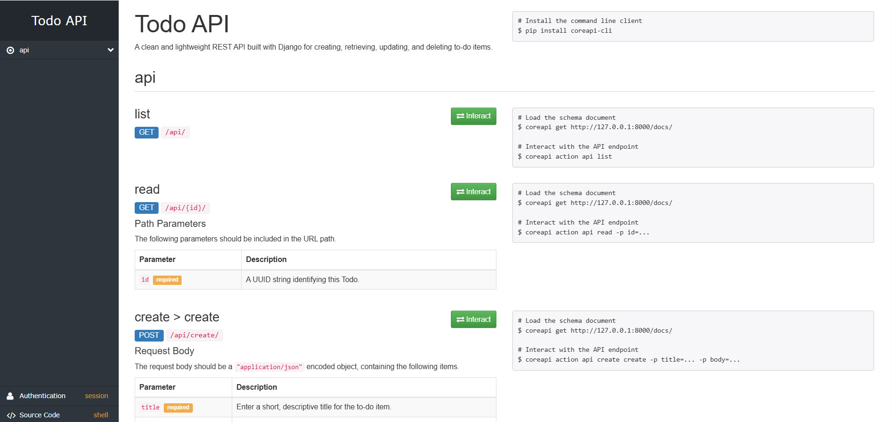
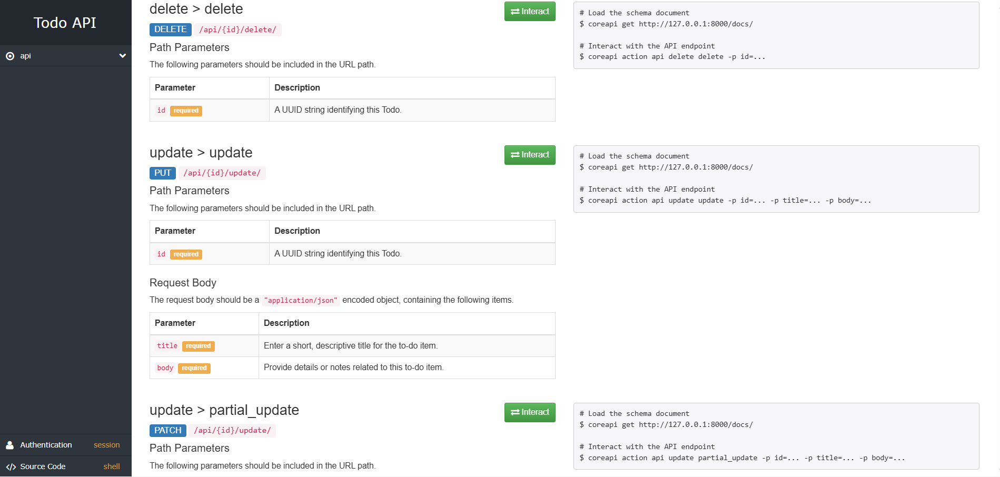

# 📝 Todo API

A simple and clean **Django REST Framework (DRF)** backend built for a **React Native To-Do App**.  
This API provides CRUD functionality for managing to-do items and includes automatically generated API documentation using DRF’s built-in documentation system.

---

## 🚀 Features

- ✅ Create, Read, Update, and Delete (CRUD) Todo items  
- 📄 API documentation automatically generated using DRF’s default docs  
- 🔑 Future user authentication (planned)  
- ⚙️ RESTful architecture built with Django REST Framework  
- 🧱 UUID-based primary keys for modern API design  

---

## 🧰 Tech Stack

- **Backend:** Python · Django · Django REST Framework  
- **Database:** SQLite (default, easily switchable to PostgreSQL or MySQL)  
- **Frontend:** React Native (to be integrated)  


---

## ⚡ Installation & Setup

### 1. Clone the repository
```bash
git clone https://github.com/Minenhle-Ngubane/todo_api.git
cd todo_api
```
### 2. Create and activate a virtual environment
```bash
python -m venv venv
source venv/bin/activate   # On Windows use: venv\Scripts\activate
```

### 3. Install dependencies
```bash
pip install -r requirements.txt
```

### 4. Apply migrations
```bash
python manage.py migrate
```

### 5. Run the development server
```bash
python manage.py runserver
```
---

Your API will be available at 👉 http://127.0.0.1:8000/api/

### The DRF API documentation is automatically available at:
http://127.0.0.1:8000/docs/




### API Endpoints
| Method       | Endpoint                 | Description                         |
|-------------|--------------------------|-------------------------------------|
| `GET`       | `/api/`                      | List all Todo items                  |
| `POST`      | `/api/create/`               | Create a new Todo                    |
| `GET`       | `/api/<uuid:pk>/`            | Retrieve a specific Todo by UUID     |
| `PUT`       | `/api/<uuid:pk>/update/`     | Update an existing Todo completely   |
| `PATCH`     | `/api/<uuid:pk>/update/`     | Update an existing Todo partially   |
| `DELETE`    | `/api/<uuid:pk>/delete/`     | Delete a Todo by UUID                |

